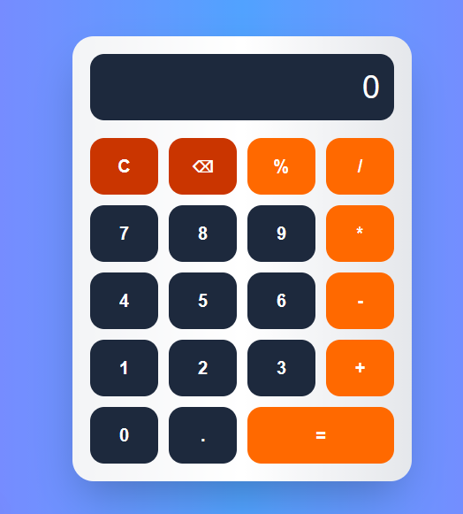

#  Modern Calculator App

A simple and modern calculator built using **Next.js (React)** and **Tailwind CSS**.  
This project performs basic arithmetic operations with a clean and responsive UI.

---

## Screenshot

---

##  Features

- Basic arithmetic operations (+, -, *, /, %)
- Delete last input (⌫)
- Clear screen (C)
- Responsive UI (mobile + desktop)
- Smooth button animations
- Error handling for invalid expressions

---

##  Tech Stack

- Next.js
- React
- TypeScript
- Tailwind CSS

---

## How It Works

- User presses buttons to build expression
- Expression is stored in state (`display`)
- `Function()` evaluates the expression safely
- Result is shown on screen

---

## Author

Sana Chishtti